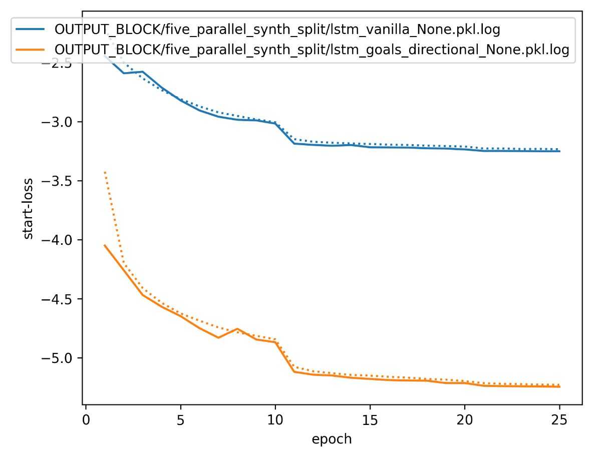
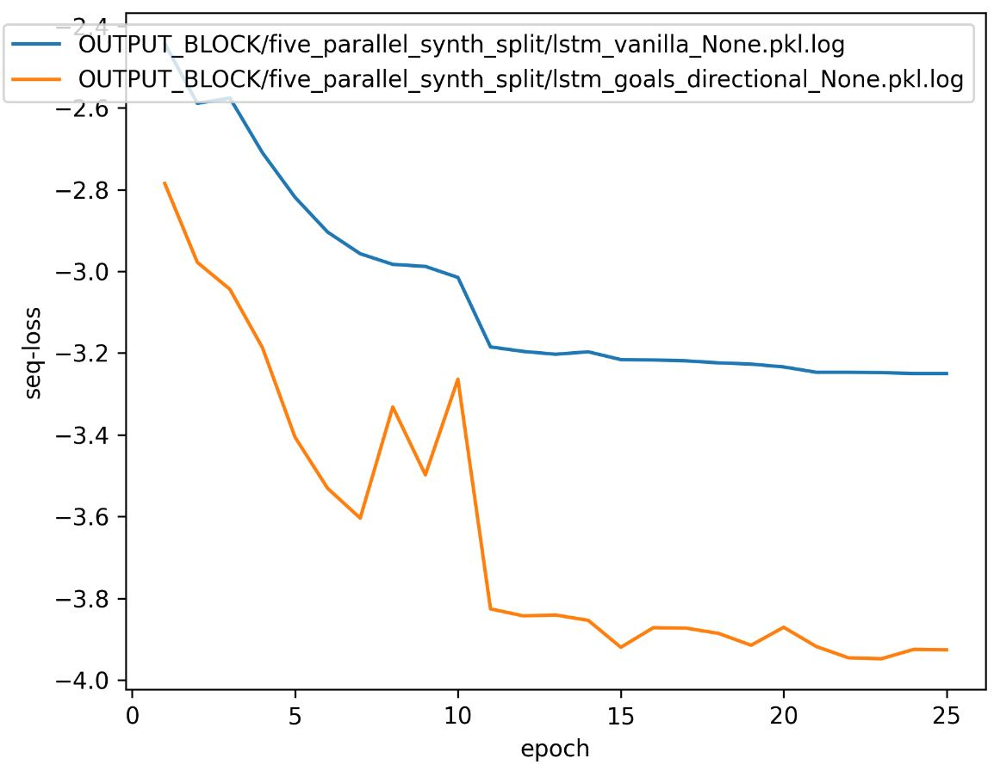
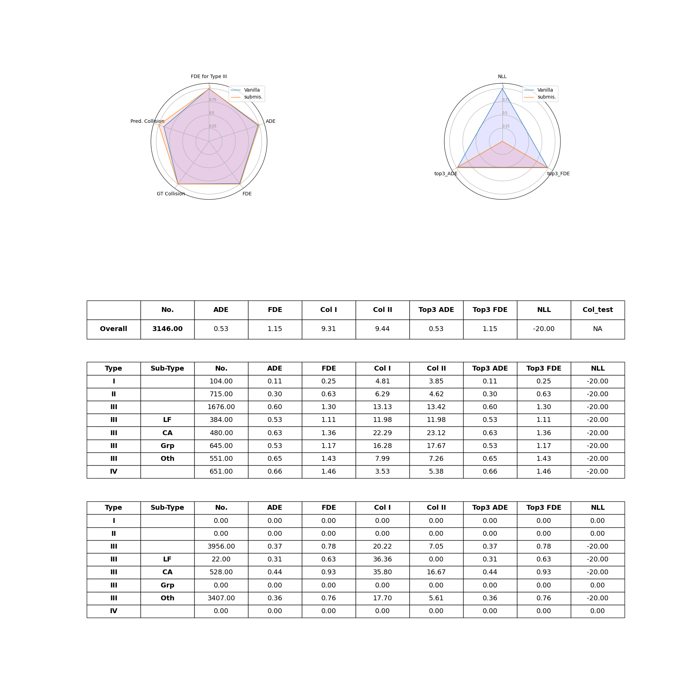
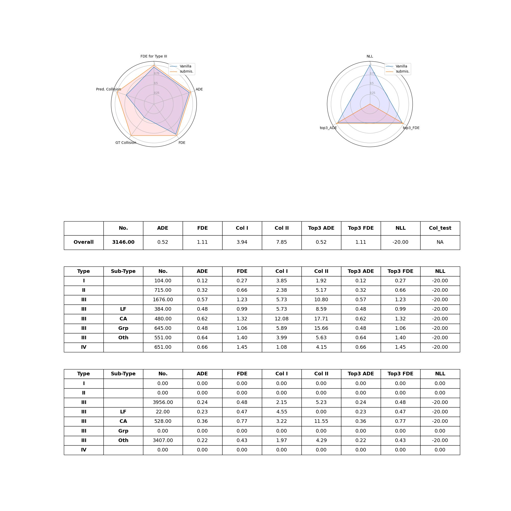
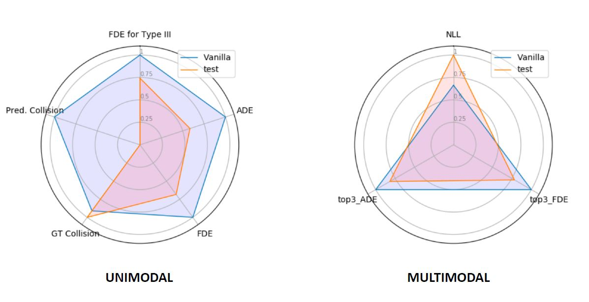

TrajNet++ : The Trajectory Forecasting Framework
================================================

Milestone 1
==========

+-----------------------------+
| **Group A**                 | 
+-----------------------------+ 
| Gaelle Abi Younes           |
+-----------------------------+
| Jean Naftalski              |  
+-----------------------------+ 
| Florent Zolliker            |  
+-----------------------------+ 

AICrowd Team Name: jeannafta

1. Comparaison between Vanilla, D-Grid, D-Grid MLP, D-Grid Occupancy on five_parallel_synth_data
-----

   **1.1 Quantitative Evaluation**
   
   The following graphs were obtained when training the five_parallel_synth_data using a Vanilla Model & a D-Grid Model:
   

   
   As expected, the start loss for D-Grid model is lower than the Vanilla's. So, it is expected that the D-Grid Model will better predict trajectories (to be verified in 1.2)
   

   The above observation was also verified with another type of loss which is the sequential loss, as shown below:
   

   
   **1.2 Scenes Choice**
   
   The following scenes show the superiority of the D-grid Model when compared to the Vanilla Model. D-Grid Model follows more closely the primary trajectory. 
   
   The best 3 scenes are: 
   
   .. figure:: docs/train/visualize_scene50932.JPG
   
   .. figure:: docs/train/visualize_scene46219.JPG
   
   .. figure:: docs/train/visualize_scene44259.JPG
   
   We played with the training options to test whiche training was the best one and we chose the following 3 scenes:
    
   .. figure:: docs/train/visualize_avec_tout_scene53383.JPG
   
   This scene shows the superiority of all models over the vanilla model.  
    
   .. figure:: docs/train/visualize_avec_tout_scene50782.JPG
   
   This scene demonstrates the superiority of directionnal model.
    
   .. figure:: docs/train/visualize_avec_tout_scene50876.JPG
   
   However, this schene showed that in some cases, the directional MLP model behaves better than the directional LSTM. 
   
   As for the results of each model: (from top to bottom: Directionalmlp, Occupancy, Directional, Vanilla)
   
   .. figure:: docs/train/Results_new.JPG 
   
   labels:
   
    The average displacement error (ADE) is the average distance between the ground truth and our prediction over all predicted time steps.
    
    The final displacement error (FDE) is the distance between the predicted final destination and the true final destination at the end of the prediction period.
    
   We can see that the directionnal have lower values for ADE and FDE than other models, this means that it must be usually the best one to approximate the groundtruth path. 
   
2. Comparaison between Vanilla & D-Grid Model using synth_data & real_data
-----

After evaluating the Vanilla Model on AICrowd, the following results for the different losses were obtained:

After evaluating the D-Grid Model on AICrowd, the following results for the different losses were obtained:

We can look at theses two images and see some terms evaluating the models.
  In the left circles (unimodal) we have:
    The average displacement error (ADE) is the average distance between the ground truth and our prediction over all predicted time steps.

    The final displacement error (FDE) is the distance between the predicted final destination and the true final destination at the end of the prediction period.
  
    The groundtruth collision (GT Collision) is the percentage of collision of primary pedestrian with the neighbors in the groundtruth future scene.
  
    The prediction Collision (Pred. Collision) is the percentage of collision of primary pedestrian with the neighbors in the predicted future scene.
  
  In the right circle (multimodal) we have:
    The NLL. Given multiple samples, the metric calculates the average negative log-likelihood of groundtruth trajectory over the prediction horizion.
    
    The top3_ADE. Given 3 output predictions, the metrics calculate the ADE of the prediction closest to the groundtruth trajectory.
    
    The top3_FDE. Given 3 output predictions, the metrics calculate the FDE of the prediction closest to the groundtruth trajectory.

It seems that the legend is wrong because the Vanilla model is always better than our submitted model, on the wo images even with our Vanilla training as submission the Vanilla has lower ADE, FDE GT Collision and Pred. Collision. We think that the legend should be inversed, because our trained model should be better than the Vanilla basic one.
It also seems that the NLL is not working by now because the value is 0 in both case for our submitted model.

Considering this, we can see interesant things:
  The Pred. Collision and the GT Collision is lower for our trained model than for the Vanilla one, this was expected.
  
  We can see that ADE and FDE are only a little bit lowe, this is not that good, it means that the submitted model is not that much better than the Vanilla one considering trajectory predictions.
  

If we look the exemple we saw on the course the legend was correct and the tested model is much better than the Vanilla one in every sections except GT Collision:

================================================

Milestone 2
==========

1. Theoritical part on contrastive learning
-----

   **1.1 Introduction**
   In this milestones the aim is to upgrade our model. There is much parameters that we can use to train our data and optain better results, we could use any techniques but the one introduced in the course is social contrastive learning.
   The advantage of this method is that we can use negatives data augmentation. Negative datas are there to give a greater importance to positive future events.  
   
   .. figure:: docs/train/contrastive_learning_representation.JPG
   
   
   
   
   For that we can use different sampling strategies and different loss functions. This first part of milestone 2 is there to show the differents possibilities we have, and to explain which one we chose, and why.
   
   **1.2 Sampling strategies**
   
     1.2.1 Social sampling
     
     The first sampling method consists in drawing negative samples based on regions of other agents at a fixed time step. So we take a certain time step and we define a boundary until where samples are positive/repectively negative.
     
     1.2.2 Local sampling
     
     The second sampling method consits in drawing negative samples based on the distance from postive sample's neighborhood. This means we take the positive samples and we add it a certain value. This value is a distance calculated with a radius and a theta based on the positive sample neighborhood.
     
     1.2.3 Event sampling
     
     The third sampling method consists in drawing negative samples based on regions of other agents across multiple time steps. This means that it is close to the Social sampling but this time we look at multiple time steps.
   
     1.2.4 Positive sampling
   
     The fourth ampling method consists in drawing hard postive samples at a given time step. This means that we look at a time step and we create the samples, then the aim is to remove the false positive, so we define a mask that gives us a limit until when it is a real positive sample and we remove the false positive samples.
   
   **1.3 Loss function**
   
   The loss function have a strong link with the sampling. The aim of the social contrastive loss is to encourage the extracted motion representation to be aware of socially unacceptable events using negative samples.
   
   **1.4 Advantages**
   
   We can see that the biggest surplus is that the collision rate will get much lower with this technique, because of the big weight putted on positive samples using negative ones.
   
2. Experiment
-----

For our experiment we want to train and evaluate models with the following settings:
Given 8 time steps of observations as imput, we want to predict future trajectories for 12 time steps for all human agents in the scene.
As in milestone 1, we will compare the models performances with FDE (Final Displacement Error). In addition, we will compare COL (collision rate).

We will train all our models with Adam optimizer.

3. Steps for this milestone
-----

   **3.1 Read through the Social-NCE package for Trajnet++ provided on Moodle**
   This part has been done to understand the code with the theory, we wrote the first section (theoritical part) based on this step.
   
   **3.2 Implement contrastive learning and sampling methods in your own codebase**
   
   **3.3 Tune Social-NCE hyperparameters for the best performance**
   
   In this step we have to change the Social-NCE hyperparameters, the basic ones are the following:
   
   - head_projection=None (?)
   
   - encoder_sample=None (?)
   
   - sampling='social' (this is the sampling method choice)
   
   - horizon=3 (?)
   
   - num_boundary=0 (?)
   
   - temperature=0.07 (?)
   
   - max_range=2.0 (?)
   
   - ratio_boundary=0.5 (?)
   
   
   **3.4 Submit your models to the AiCrowd platform**
